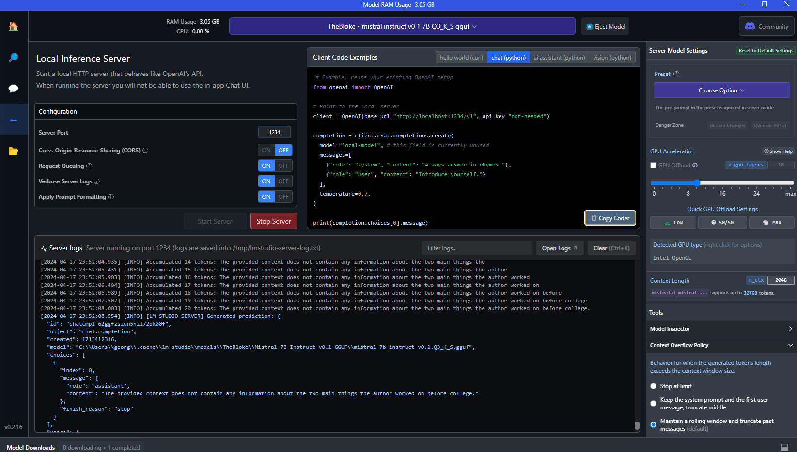

# LLM Magic with Mistral

## Overview
This repository contains materials for a practical assignment focused on integrating Ollama's Mistral Large Language Model (LLM) into a Retrieval-Augmented Generation (RAG) system. The centerpiece of this assignment is the `llm-magic-with-mistral.ipynb` Jupyter Notebook, which demonstrates the application of the Mistral LLM for building a chatbot.

## Getting Started

### Prerequisites
Ensure you have Jupyter installed on your machine or use any platform that supports Jupyter Notebooks.

### Configuration
Before running the notebook, you need to set up the necessary configurations:
1. Locate the `config.ini.template` file in this repository.
2. Rename it to `config.ini`.
3. Open the `config.ini` file and update the variables according to your requirements or credentials needed to access the Mistral LLM.

### Running the Notebook
Open the `llm-magic-with-mistral.ipynb` notebook in Jupyter to start experimenting with the chatbot powered by the Mistral LLM. Follow the instructions within the notebook to learn more about the implementation and how to interact with the chatbot.

## LM Studio

### About LM Studio
LM Studio is a graphical interface designed to facilitate the development and testing of machine learning models, particularly focusing on language models. It provides tools and visualizations that help users fine-tune and evaluate models efficiently and effectively.

## Contributions and Feedback
Feel free to fork this repository, contribute changes, or submit issues if you encounter any problems or have suggestions for improvement. Your feedback is invaluable to making this resource better for everyone.

